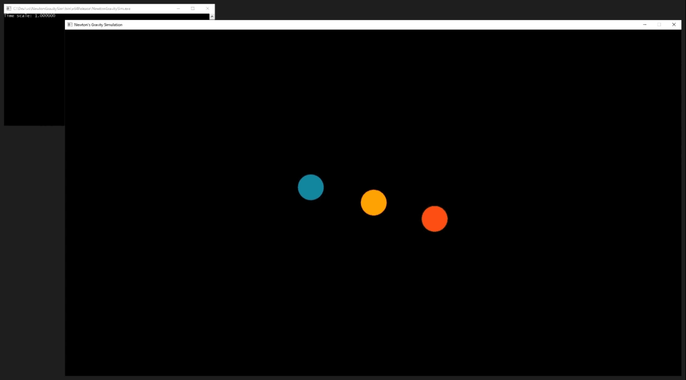

# Newton's Gravity Simulation

This is a simulation of celestial objects in space interacting with each other with [Newton's law of universal gravitation](https://en.wikipedia.org/wiki/Newton%27s_law_of_universal_gravitation). It is made using the [SFML library](https://www.sfml-dev.org/) in C++. Newton's law of universal gravitation is a close approximation of how objects attract each other in space. Every measurement in the program is done in [SI units](https://en.wikipedia.org/wiki/SI_base_unit) so we can accurately replicate certain orbits in space given we get the initial conditions correct. For example, this is the orbit of our moon around Earth at 65472 times speed:

The [Three-body problem](https://en.wikipedia.org/wiki/Three-body_problem) is the study of finding stable orbits consisting of three bodies with equal masses. By creating three bodies with the correct initial conditions, we can replicate a stable three-body orbit in our program:

## Controls

To speed up the timescale, press the "***+***" key.\
To slow down the timescale, press the "***-***" key.\
To zoom in and zoom out, use the ***mouse scroll wheel***.\
To pan around, ***click and drag the mouse scroll wheel***.
